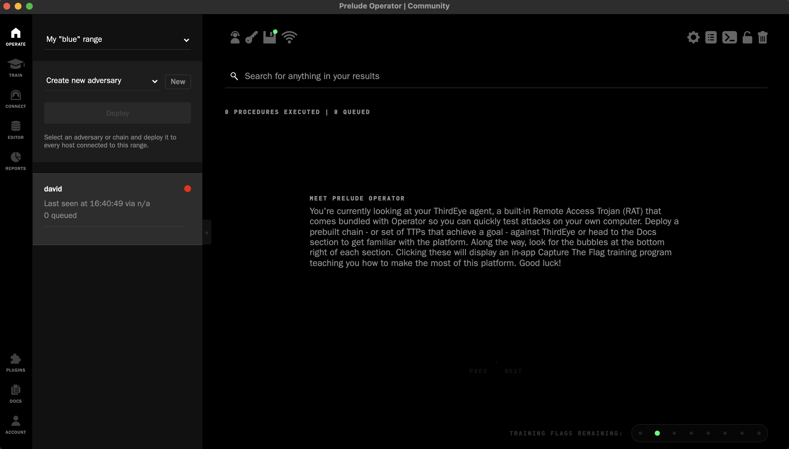
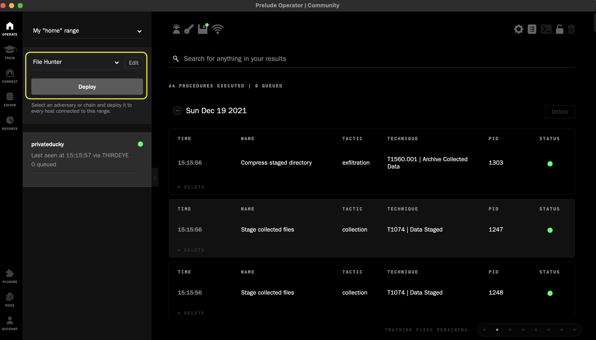
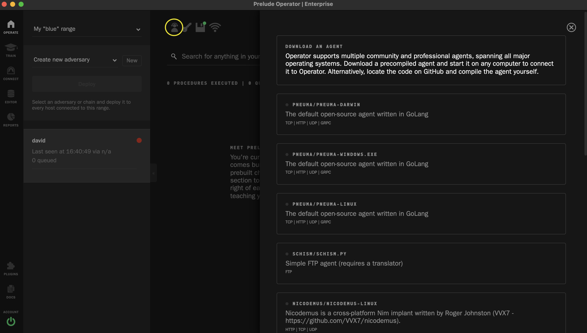
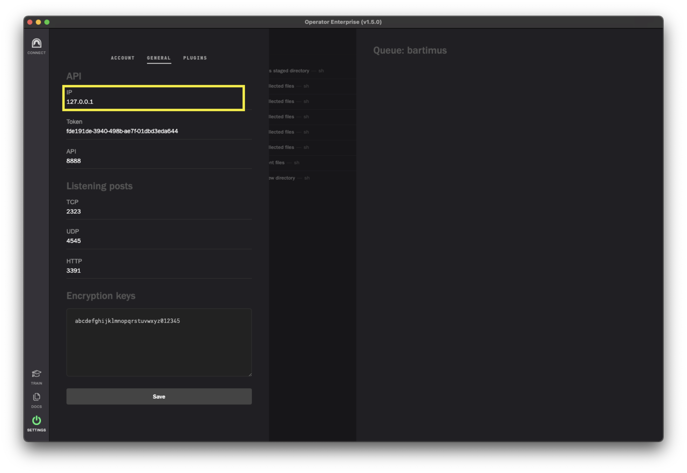

[](https://github.com/preludeorg/operator-support/releases)
# Operator

### This repository is the spot to report bugs or submit feature requests.

Operator is an autonomous red team C2 platform, built by [Prelude](https://prelude.org). It is designed for red, purple and blue teamers to conduct realistic threat assessments. Using the desktop application, you can deploy agents on remote computers and launch custom adversary profiles against them to identify the holes that antivirus programs & vulnerability scanners are not designed toweb locate.

> Watch our quick [introduction video](https://www.youtube.com/watch?v=Hz8K-jdqpBY)

You can download the latest copy of the application [here](https://www.prelude.org/download/current), for either MacOS, Windows or Linux.

> Did you know that the team at Prelude runs free red team training programs as part of our open-source outreach? We teach IT/InfoSec/DevOps/defenders/software engineers how to red team, so they can apply practical techniques to their day jobs. Check out the [Pink Badge](https://www.prelude.org/training/pinkbadge) for more details.

## Community

When you start Operator, your app loads in our [community](https://github.com/preludeorg/community) resources in order to populate your environment with hundreds of open-source TTPs, payloads, agents, tools, training modules and more. We encourage contributions, so if you'd like to add TTPs for other Operator members, publish your own agents or come up with a new training flag for any of the programs - submit a pull request!

## Resources 

The Prelude development & security teams run several supporting resources for the community:

- A [Discord server](https://discord.gg/NWURE99JzE) to interact with the team.
- A [YouTube video library](https://www.youtube.com/preludeorg) containing tutorials and use-cases.
- A [blog](https://feed.prelude.org), where we post on general security and specific Operator topics.
- Details about our [weekly and out-of-band TTP releases](https://chains.prelude.org).

## Operator Terminology

- Tactics, Techniques and Procedures (TTPs) - are the individual attacks you can send to your agents in order to test the endpoint's security. 
- Chains - are sets of TTPs which are often based on a real adversary kill chain. 
- TTP Tuesday - is a weekly chain release, designed by Prelude's security team and often based on notable attacks or novel techniques. (**Available to Professional License Holders**)
- N-Day Chains - is an out-of-band priority chain based on real world 0-Day releases. (**Available to Professional License Holders**)
- Agents - are binaries (or scripts) which execute the deployed TTPs or Chains found in Operator. The Prelude security team develops multiple agents which are designed to fully support Operator's full feature set. These agents are modeled after the tools used by real adversaries. The community has also created a few open-source agents that work with Operator's underlying API.
- Task (Link) - is a beacon which the agent receives from Operator as well as the result it sends to Operator. A link contains properties like the initial request, the agent's response, the process PID, and the status (code).
- ThirdEye is a NodeJS agent that is built into Operator itself. ThirdEye lives in your home range and is often used to test deployment of a chain or TTP. Every time you open Operator, you will have access to your ThirdEye agent (ThirdEye is named after your computer's hostname).
- Pneuma - Prelude's default open source agent. [Source code is available here.](https://github.com/preludeorg/pneuma)

## Quick Start

Whether you are using Operator for the first time or you are checking out the new v1.5 release, below is a quick rundown of how to get started.

## Installation

> Operator is a multi-platform compiled Electron/NodeJS app.

1. Head to https://www.prelude.org/download/current and download a copy of Operator for your operating system.
2. Double-click the downloaded executable to install Operator the same as any other desktop app.
3. Open Operator. You'll be created with the main dashboard where you'll deploy chains or individual TTPs and watch the results stream in. 

## Deploying a chain

> When running an operation, keep an eye on the "View Queue" button. Clicking this will show you the procedures from your chain that are awaiting execution by the agent. If any TTPs are skipped or queued, they might be waitin for other TTPs to complete or for a specific Fact to be present.

1. Select the default ThirdEye agent. 
2. Click "Launch Chain".
3. Type the name of a Chain in the "Find an attack chain to deploy" (File Hunter is recommended) 
4. Click deploy. This will send the chain to the selected agent.
5. Within a few seconds you should see results starting to stream into your agent's result log. Click on any row to view additional information on the result.
    


## Using an Agent other than ThirdEye

> Using an agent other than ThirdEye (which is baked into Operator) can allow access to additional features (Other protocol support, reverse shells, etc...).

1. You can download one of Prelude's other agents by clicking the Download button in Operator



2. Launch the agent. (Operator runs on localhost by default, most agents are designed to automatically connect to Operator when executed)
3. Your agent should now show up in the list of agents on the main page.

> If you would like to have Operator listen for connections from other computers on the network you can follow these optional steps

4. (optional) Change Operator's IP address from 127.0.0.1 (localhost) to your computer's local IP address. You can make this change by clicking Settings (bottom left), then clicking the General Tab at the top of that page, look for the IP field under the API heading. Doing so will allow other computers's on your network to reach Operator's listening posts at ports 2323 (TCP), 4545 (UDP) and 3391 (HTTP).



> Connecting an agent to the IP you just changed
   
5. (optional) Download a copy of the Pneuma agent from Operator as detailed above or build it from [source](https://github.com/preludeorg/pneuma).
6. (optional) Copy Pnuema to another computer with access to the IP you changed in step 4.
7. (optional) Start Pneuma with these parameters, replacing **IP** with the IP address from step 4. ```./pneuma-darwin -name boogeyman -range red -address IP:2323```.

> The following step is for connecting an Agent to Operator from anywhere on the internet.

8. (optional) Deploy a redirector and connect Operator to it by clicking the [Connect Button](https://www.youtube.com/watch?v=St1GvE40-9Q).
9. (optional) Copy Pneuma to a computer that can access the Redirector from step 8, then run the following command, replacing the **IP** with the public DNS hostname from your redirector. ```./pneuma-darwin -name boogeyman -range red -address IP:2323```

## Where to go from here?

1. Create your own TTPs or Create your own chain using some of the hundreds of TTPs already present. This is an Integrated Development Environment for building your own procedures or adversaries. 
2. Click on the Train section to take any of the free, interactive training programs built into Operator. 
3. Head into the Connect section to provision redirectors and test ranges to practice against. 
4. Advanced user? Go to Settings -> Plugins section to build your own extensions to the platform.
5. Pop into our [Discord server](https://discord.gg/NWURE99JzE) where we have an active Operator community.

