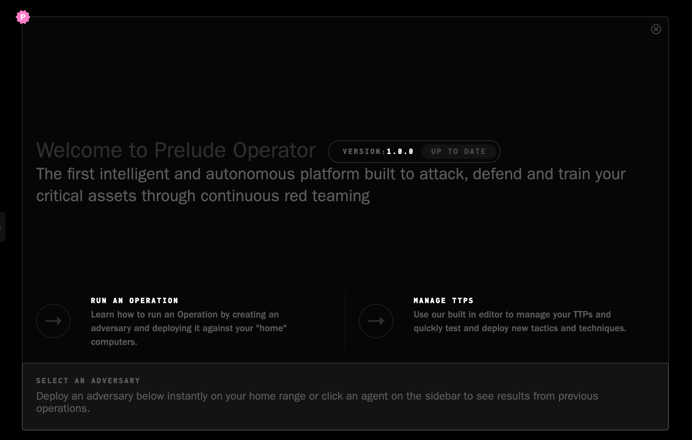

# Operator

Operator is an autonomous red team C2 platform, built by [Prelude](https://prelude.org). It is designed for red, purple and blue teamers to conduct realistic threat assessments. Using the desktop application, you can deploy agents on remote computers and launch custom adversary profiles against them to identify the holes that antivirus programs & vulnerability scanners are not designed to locate.

> Watch our quick [introduction video](https://www.youtube.com/watch?v=Hz8K-jdqpBY)

You can download the latest copy of the application [here](https://www.prelude.org/download/current), for either MacOS, Windows or Linux.

> Did you know that the team at Prelude runs free red team training programs as part of our open-source outreach? We teach IT/InfoSec/DevOps/defenders/software engineers how to red team, so they can apply practical techniques to their day jobs. Check out the [Pink Badge](https://www.prelude.org/training/pinkbadge) for more details.

This repository contains the following:

1. Known bugs & feature requests (check the issue tab)
2. All open-source plugins, which are separate components you can install inside Operator
3. A collection of tools which work with the Operator ecosystem
4. Standalone python servers - called translators - which accept agent beacons over one protocol and translate them into an Operator protocol (usually HTTP) so you can build your own supported protocols.

## Resources

The Prelude development & security teams run several supporting resources for the community:

- A [quick start guide](docs/quickstart.md) to get Operator running with a single Pneuma agent.
- A [Discord server](https://discord.gg/NWURE99JzE) to interact with the team.
- A [YouTube video library](https://www.youtube.com/channel/UCZyx-PDZ_k7Vuzyqr4-qK9A) containing tutorials and use-cases.
- A [blog](https://feed.prelude.org), where we post on general security and specific Operator topics.
- [Pneuma](https://github.com/preludeorg/pneuma): A cross-platform GoLang agent that connects to Operator and executes attacks.
- [Community](https://github.com/preludeorg/community): A collection of ATT&CK-classified procedures which Operator can send to agents, like Pneuma, to execute.
