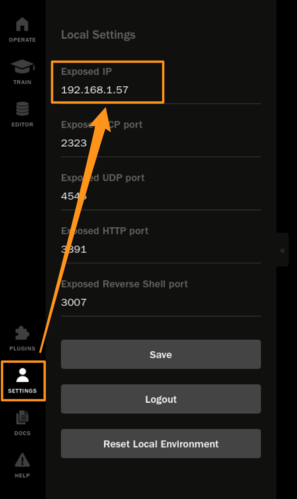
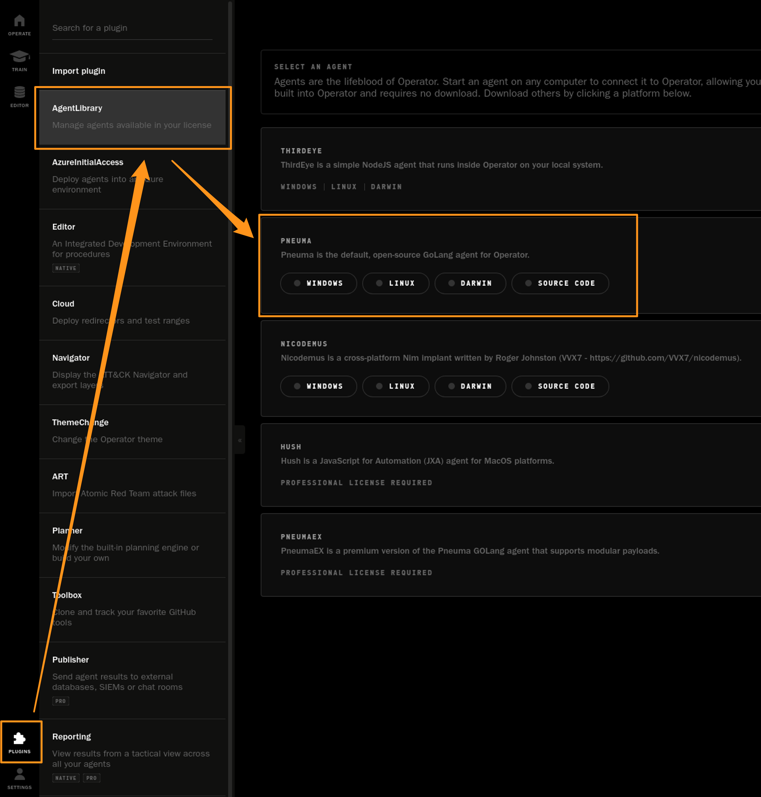
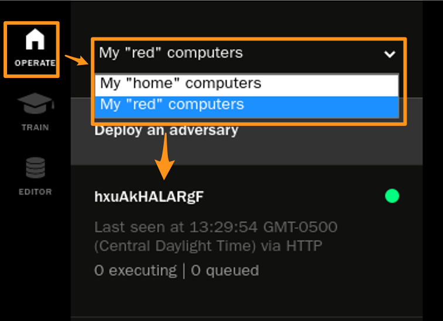
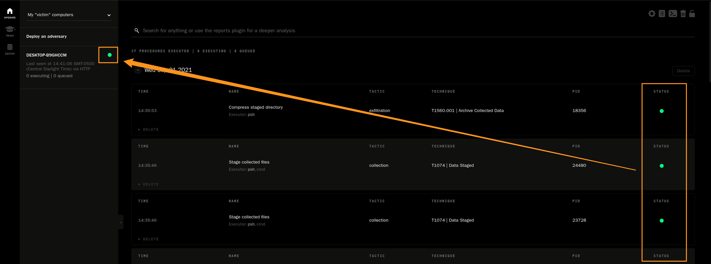

[](https://github.com/preludeorg/operator-support/releases)

# Quick Start Guide

This quick start is meant to provide you with a running Operator Controller and a single remote [Pneuma](https://github.com/preludeorg/pneuma) agent. This will use all default settings. Please explore additional capabilities and features and contribute new guides.

## Environment Preparation

You'll need 1 Controller and you'll need 1 victim system.

The Controller can be Windows, Linux or macOS. The victim can be Windows, Linux, or Darwin.

### Controller

The Controller can be any system. Download the Prelude Operator controller [here](https://www.prelude.org/download/current). Select the correct binary for your OS - for Linux, you will need a GUI.

Copy down your IP address, you'll need it in the following steps.

You'll need to make the following firewall changes:

**Linux (all flavors)**
```
sudo firewall-cmd --add-port=2323/tcp --add-port=4545/tcp --add=port=3391/tcp 3007/tcp --permanent
sudo firewall-cmd --reload
```

**Windows**
```
netsh advfirewall firewall add rule name="Prelude Operator Ports" dir=in action=allow protocol=TCP localport=2323
netsh advfirewall firewall add rule name="Prelude Operator Ports" dir=in action=allow protocol=TCP localport=4545
netsh advfirewall firewall add rule name="Prelude Operator Ports" dir=in action=allow protocol=TCP localport=3391
netsh advfirewall firewall add rule name="Prelude Operator Ports" dir=in action=allow protocol=TCP localport=3007
```

### Victim

For this guide, you only need 1 victim. Here are the steps for Windows, macOS, and Linux (RHEL and Ubuntu).

**Windows** (you'll need to have [Chocolatey installed](https://chocolatey.org/install#individual).

```
choco install golang git
git clone https://github.com/preludeorg/pneuma.git
cd pneuma
go run main.go -contact http -address http://[your-controller-ip]:3391
```

**macOS** (you'll want to use Homebrew (`/bin/bash -c "$(curl -fsSL https://raw.githubusercontent.com/Homebrew/install/HEAD/install.sh)"`))

```
brew install git golang
git clone https://github.com/preludeorg/pneuma.git
cd pneuma
go run main.go -contact http -address http://[your-controller-ip]:3391
```

**Linux**

CentOS/Fedora/Redhat

```
sudo dnf install epel-release -y
sudo dnf install golang git -y
git clone https://github.com/preludeorg/pneuma.git
cd pneuma
go run main.go -contact http -address http://[your-controller-ip]:3391
```

Ubuntu

```
sudo apt-get install golang git -y
git clone https://github.com/preludeorg/pneuma.git
cd pneuma
go run main.go -contact http -address http://[your-controller-ip]:3391
```

## Setup

Once you have your environment prepped, you'll want to start the Operator Controller. If you downloaded Operator for Windows or macOS, you can just "double-click" like normal to run a package/program. For Linux, the package comes as an `.appImage` file, this requires you to mark it as "executable." You can do this by right-clicking on the `.appImage` file and select Properties, and then Permissions, and then check "Allow executing file as program".

Once Operator loads, click on "Settings", enter your "Exposed IP" (your Controller IP), and then click "Save".



Next, click on "Plugins", click on "AgentLibrary", and then select the OS of your victim to download the Pneuma agent on your Collector system.



Copy the Pneuma agent that downloaded to your victim system and run it as an administrator. Ensure you have followed the [environment preparation](#environment-preparation) steps for your Controller and victim (specifically, the firewall and `go run ...` steps).

### Running

Click on the Operate button, change to "red computers" and then you should see your victim reporting in.



If you click on the implant reporting in, you can click on the cog wheel in the upper-right and rename it, create new groups, etc. This isn't mandatory.

Next, you can click on "Deploy an adversary" and then use the dropdown to select what "adversary" to emulate. In this example, we'll use "File Hunter". Click "Build Adversary".


Finally, click the "Deploy" button and the "adversary" will be deployed to the agent and return the results. Depending on the adversary you deploy this could take a few minutes for results. Results have been returned when the indicator light next to the implant turns green.



Explore additional adversaries.

## Resources

The Prelude development & security teams run several supporting resources for the community:

- A [quick start guide](docs/quick-start.md) to get Operator running with a single Pneuma agent.
- A [Discord server](https://discord.gg/NWURE99JzE) to interact with the team.
- A [YouTube video library](https://www.youtube.com/channel/UCZyx-PDZ_k7Vuzyqr4-qK9A) containing tutorials and use-cases.
- A [blog](https://feed.prelude.org), where we post on general security and specific Operator topics.
- [Pneuma](https://github.com/preludeorg/pneuma): A cross-platform GoLang agent that connects to Operator and executes attacks.
- [Community](https://github.com/preludeorg/community): A collection of ATT&CK-classified procedures which Operator can send to agents, like Pneuma, to execute.
