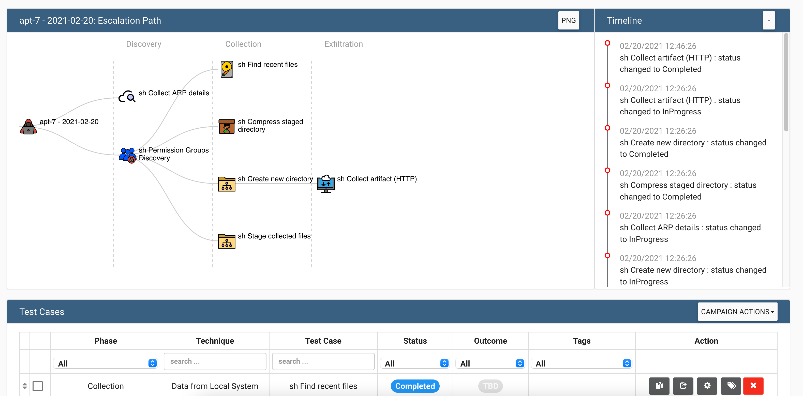

# VECTR

VECTR is a purple team tool for manual security assessments (campaign planning & reporting). 

This repository contains a simple Vagrantfile to spin up a server with VECTR pre-installed. 

## Install 

```
vagrant up
```

Then head to https://localhost:8081 and log in with username=```admin``` and password=```11_ThisIsTheFirstPassword_11```

> You may get redirected to https://sravectr.internal:8081/auth/login when logging in. You will need to replace this with https://localhost:8081.

## Operator integration

If you have a Professional license, you will see VECTR in the Publisher plugin. Enter the absolute path to a new CSV
file on your computer to "publish" all attack results to a file you can later import into VECTR.